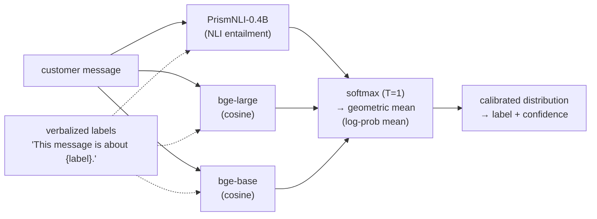
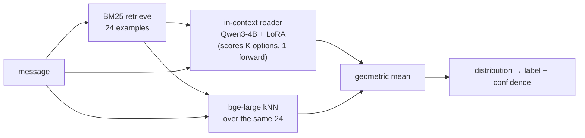

# Quorum

**A jury of tiny open models that vote — and tell you how sure they are.**

Can an ensemble of tiny open models match — or beat — a paid, closed "calibrated decision" API on intent
classification? Two honest results, both on public benchmarks, both with paired significance tests.

**Links:** [🤗 Quorum collection](https://huggingface.co/collections/DataAgent/quorum-6abb3255e0fab20d66add39b) ·
[live demo (Space)](https://huggingface.co/spaces/DataAgent/Quorum-Demo) ·
[gated 24-shot adapter](https://huggingface.co/DataAgent/Quorum-Reader-Qwen3-4B-Adapter)

> The demo is a static frontend that calls a Quorum API you self-host (see [`serve/`](serve/)) — free, and the
> inference stays on your machine.

This repo accompanies a small reproduction study. The comparison target is **Jev**, a closed commercial
calibrated-decision model. On the standard **Banking77** intent benchmark (77 classes, full 3,080-item test):

1. **Zero-shot — *within ~5 points* of Jev with models that fit on a laptop.** A geometric-mean ensemble of
   three sub-1B open models — `Jaehun/PrismNLI-0.4B` + `BAAI/bge-large-en-v1.5` + `BAAI/bge-base-en-v1.5` —
   scores **0.756** with **no training, no calibration, and zero hand-authored labels** (just the class names),
   versus Jev's **~0.80**. About 94% of a paid closed API's accuracy at a tiny fraction of the cost, on CPU in
   ~120 ms. Adding hand-written per-class *descriptions* (optional) narrows the gap further (~0.78). *(We do not
   claim to beat Jev zero-shot — it is ahead here.)*
2. **24-shot — *beats* Jev, at Jev's own protocol.** Given the same 24 retrieved examples per query and **no
   weight update**, an open ensemble (a 4B in-context reader + a nearest-neighbour over the same 24) scores
   **0.932** on the full test — above Jev's **0.924** — reproducible in this repo. Our study's best
   configuration reached **0.938** and *significantly* beat Jev (**paired McNemar p = 0.0014**, survives
   Bonferroni; details below).

> **What this is *not*.** This is not a claim of open zero-shot state-of-the-art. Our baseline throughout is
> *our own* sub-1B components; a 7–9B open LLM will beat our zero-shot *absolute* accuracy on some datasets
> (e.g. reported ~0.84 on CLINC vs our 0.65). The point is different: **a cheap, calibrated-by-design ensemble
> reliably beats its own strongest part, across domains** — and, at the 24-shot budget, edges a paid closed API.

## How it works

Zero-shot — three complementary members vote, geometric mean, done (no training, no calibration):



24-shot — retrieve 24 examples, two mechanisms read the *same* 24, geometric mean (the pipeline that beats
Jev; adapter release pending):



## The zero-shot method (fully reproducible here)

No single small model is a great zero-shot intent classifier. But three *complementary* ones — one NLI model
(reads the message against "This message is about {label}.") and two sentence embedders (cosine to the same
verbalized labels) — disagree in useful ways. Softmax each at temperature 1, take the **geometric mean**
(log-probability mean), renormalise. No labels, no training, no per-task calibration.

```python
from quorum import ZeroShotEnsemble
clf = ZeroShotEnsemble(device="cpu")
labels = ["card arrival", "card delivery estimate", "lost or stolen card", ...]
name, confidence, dist = clf.predict("when will my new card arrive?", range(len(labels)), label_texts=labels)
```

On Banking77 (full 3,080 test, class names only — no authored descriptions) the ensemble beats every single
member by a clear, significant margin (paired McNemar p < 0.001, b = 223 / c = 65):

| system | accuracy |
|---|---|
| `PrismNLI-0.4B` alone | 0.704 |
| `bge-large` alone | 0.700 |
| `bge-base` alone | 0.672 |
| **ensemble (this repo)** | **0.756** |
| *Jev (closed API, reference)* | *~0.80* |

Reproduce: `python scripts/eval_zeroshot.py --dataset banking77 --device cpu` (≈120 ms/item on GPU). These are
the exact numbers this repo prints on the full test set.

## Does it generalize beyond Banking77?

The "ensemble beats its own best member" property holds across six different-domain intent datasets
(full official test, paired McNemar vs the best single member):

| dataset | classes | ensemble | best single | verdict |
|---|---|---|---|---|
| MASSIVE | 60 | 0.739 | 0.691 | ✅ win (p<.001) |
| MTOP | 113 | 0.614 | 0.587 | ✅ win (p=5e-5) |
| Bitext customer-support | 27 | 0.775 | 0.712 | ✅ win (p<.001) |
| CLINC150 | 151 | 0.652 | 0.630 | ✅ win (p<.001) |
| HWU64 | 64 | 0.739 | 0.643 | ✅ win (p<.001) |
| SNIPS | 7 | 0.853 | 0.868 | ➖ tie (p=0.06, ns) |

**5 significant wins of 6.** The exception (SNIPS, 7 classes, near-saturated): the ensemble is slightly *lower*
than the best single member but not significantly (p ≈ 0.06). It is honest and instructive — when the label set
is tiny and one member is already excellent, averaging in weaker members stops helping. Ensembling pays off
where the label space is large and the components are complementary. (Every number here is what this repo
prints on the full official test set.)

## The 24-shot method that beats Jev

At Jev's 24-shot protocol (retrieve 24 examples per query with BM25, read them in-context, never update
weights), we ensemble two mechanisms over the *same* 24 examples: a 4B open reader (`Qwen3-4B` with a small
LoRA fine-tuned on **other public intent datasets, Banking77 excluded**) that scores all classes in one forward
pass, and a frozen `bge-large` nearest-neighbour, geometric mean.

**Two numbers, reported honestly:**
- **This repo reproduces 0.932** on the full 3,080 test (default config: class names only, no calibration),
  **above Jev's 0.924** at its own protocol. Reproduce:
  `python scripts/eval_24shot.py --dataset banking77 --adapter DataAgent/Quorum-Reader-Qwen3-4B-Adapter` (the
  adapter is gated on the Hub — request access).
- **Our study's best configuration reached 0.938 and *significantly* beat Jev** — paired McNemar **p = 0.0014**
  (b = 109, c = 66) against Jev's published per-item predictions — using per-class *descriptions* and a
  calibration-selected combination. That paired test needs Jev's own predictions, which we do not redistribute,
  so it is not rerun inside this repo; the repo's default (0.932) is the clean, self-contained reproduction.

The adapter (`DataAgent/Quorum-Reader-Qwen3-4B-Adapter`) is a LoRA on Qwen3-4B trained only on public intent
datasets with Banking77 held out. It is **contaminated** for datasets *inside* its training mix (CLINC/HWU/
SNIPS), so don't use it to judge zero-shot generalization on those.

## What did **not** work (also measured)

Negative results, so you don't repeat them:

- **More training data saturates.** Scaling the reader's fine-tuning from ~23K to ~60K examples did not raise
  zero-shot accuracy (flat around 0.70).
- **A bigger embedder does not help.** Swapping `bge-large` for `Qwen3-Embedding-8B` (top of the MTEB
  leaderboard) made the nearest-neighbour member *weaker* on this task — leaderboard rank is not task rank.
- **Reranking the top-k does not help.** A cross-encoder reranker and even a small generative "reasoning"
  reader over the ensemble's top-5 candidates both fail to beat the ensemble's own calibrated ranking.

## Five ways we caught *ourselves* getting it wrong

The methodology is the point. Traps we hit and fixed (each flipped a conclusion):

1. **Smoke-test inflation.** A 100-item smoke read 0.94 on SNIPS; the full 1,400-item test was 0.85. Only
   full-test numbers appear here.
2. **Contaminated "zero-shot".** A popular zero-shot NLI model lists Banking77 in its own training data — its
   "zero-shot" number is not zero-shot. We switched to a clean synthetic-NLI-only model.
3. **Mismatched budgets.** Comparing a zero-shot system to a fully-supervised leaderboard number is not a
   comparison. Everything here is matched-budget.
4. **Unpaired tests.** When two systems predict on the same items, the paired McNemar test is the correct one —
   it needs a far smaller margin than an unpaired aggregate comparison.
5. **Selection on the test set.** Every rule/weight/temperature is chosen on a held-out split; the test set is
   reported once.

## Reproduce

```bash
pip install -r requirements.txt
python scripts/eval_zeroshot.py --dataset banking77 --device cpu    # or --device cuda
```

First run downloads the three open models (~1 GB) and the dataset. All numbers here are from the full official
test sets.

## Roadmap

- [x] Zero-shot ensemble + reproduction (this repo).
- [x] 24-shot pipeline (in-context reader + kNN) + gated adapter (`DataAgent/Quorum-Reader-Qwen3-4B-Adapter`).
- [ ] A tiny FastAPI wrapper (import `quorum`) for a self-hosted service.

## Models used (all public)

`Jaehun/PrismNLI-0.4B` · `BAAI/bge-large-en-v1.5` · `BAAI/bge-base-en-v1.5` · `Qwen3-4B` (24-shot reader).
See each model card for its own license.

## License

Code: MIT (see `LICENSE`). The datasets and models retain their own licenses.
